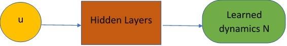

# forwardEulerNET

Differential equations are used to model problems that originate in disciplines such as physics, biology, chemistry, and engineering. In recent times, due to the abundance of data, there is an active search for data-driven methods to learn Differential equation models from data. However, many numerical methods often fall short. Advancements in neural networks and deep learning, have motivated a shift towards data-driven deep learning methods of learning differential equations from data. In this work, we propose a forward-Euler based neural network model and test its performance by learning ODEs such as the FitzHugh-Nagumo equations from data using different number of hidden layers and different neural network width.

## Highlights
- Formulate a neural network
- A residual ODE connection inspired by the forward-Euler scheme will be used to construct the loss function.
- we demonstrate that a loss function built using a forward Euler temporal scheme in the network formulation is able to learn the form of an ODE from data to high accuracy.

### Training

Here, we show that training the network with simulated data, the network learns the dynamics of the dynamical system and a predicted solution is obtained using the learned dynamics in an ODE solver such as scipy's odeint.

## Requirements

- Python 3.9.6
- import tensorflow.compat.v1 as tf
- Other packages, such as *Matplotlib, Numpy and Scipy*, are also used

